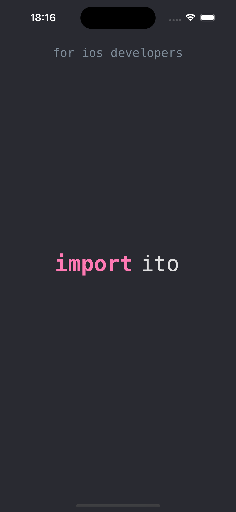
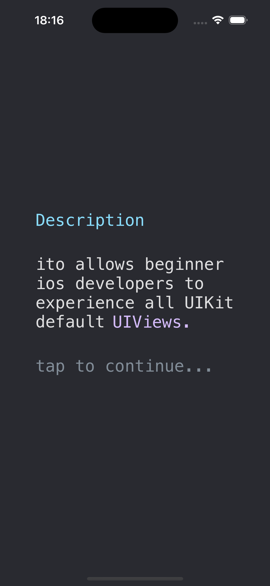
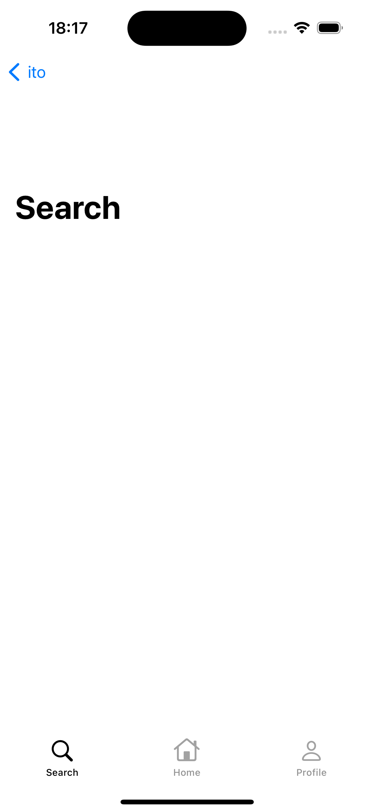
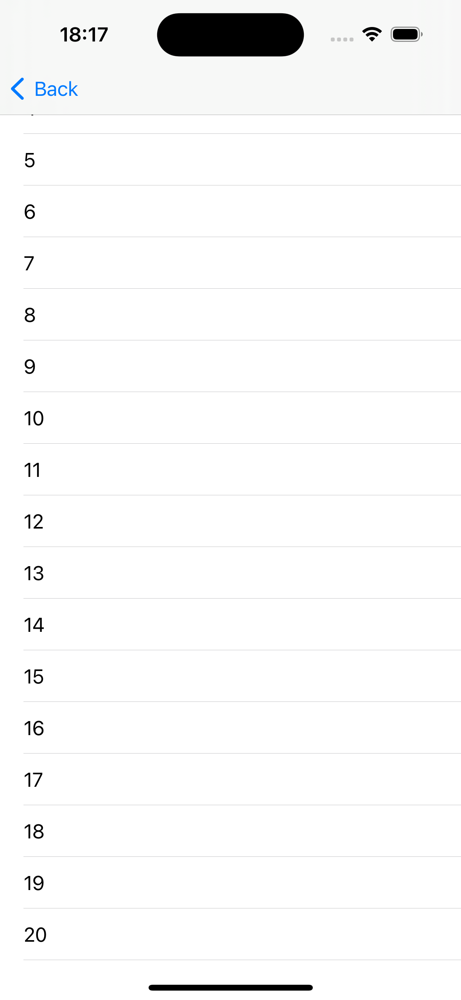
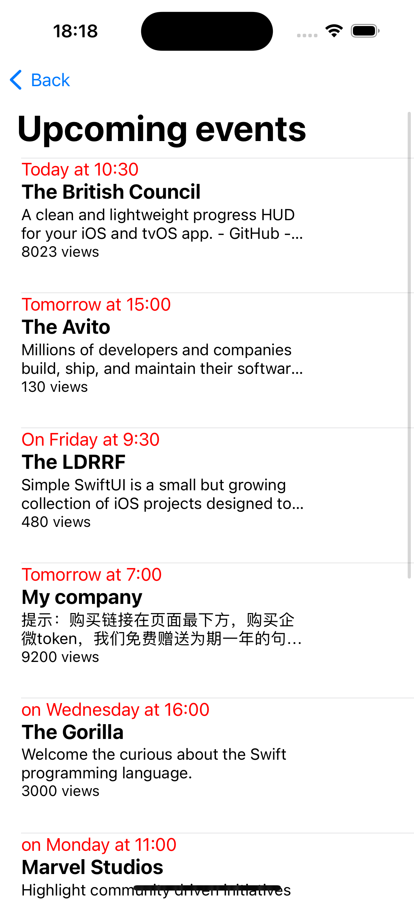
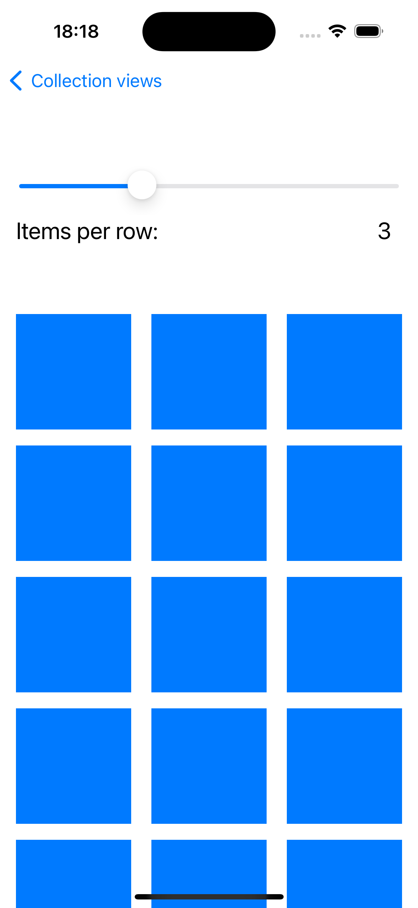
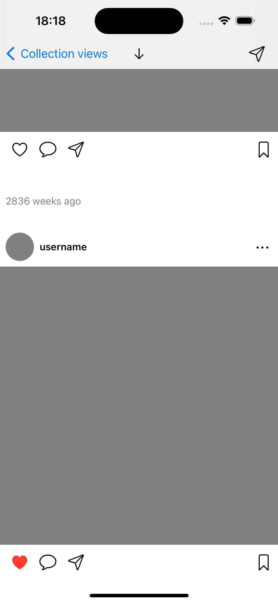
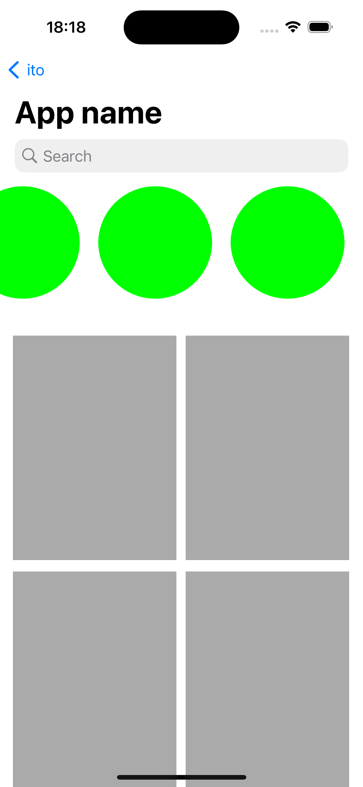

# ito
ito (iPhone - tour) - is an iOS app that allows iOS developers to story UIKit's default views

      
   
     

### This project is not complete! Feel free to clone and use this repo however you want.


## About
Back to the times when I was studying iOS development, I decided to create such app to help beginner developers like myself study all possible views and ways creaate views in UIKit Swift. However I did not finish this project but still want to leave it here...

## Usage
Just clone the project into XCode or download .zip file.
Paste in terminal:
```bash
git clone https://github.com/kostya-lee003/ito.git
```

